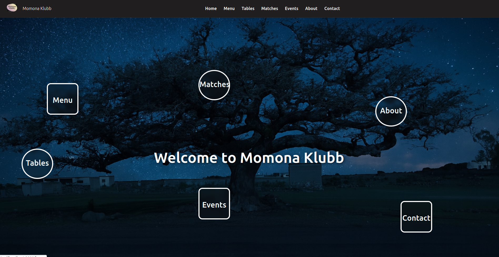

---

# Momona Klubb – Full Stack Application

## Overview

Momona Klubb is a full-stack web application developed for a community club.
It enables customers to browse the menu, check game/table availability, join waiting queues, view upcoming events, and follow sports match updates.
Administrators can manage all these sections through a secure login system.




---

## Features

### Public

* View menu items with images, descriptions, and prices.
* Check availability of games such as pool tables, foosball, and card games.
* Join a waiting queue for games.
* Browse upcoming events.
* View upcoming sports matches.

### Admin

* **Menu Management**: Create, update, hide/show, and delete menu items.
* **Game Management**: Update availability, manage queues, and assign players.
* **Event Management**: Add, edit, hide/show, and delete events.
* **Sports Management**: Add, edit, and delete sports matches.
* **Image Upload**: Upload images for menu items and events.
* **Authentication**: JWT-based login with role protection.

---

## Technology Stack

* **Backend**: ASP.NET Core Web API (C#)
* **Database**: SQLite (`momona.db`)
* **Frontend**: React (TypeScript) with styled-components
* **Authentication**: JWT Bearer Tokens
* **External API**: TheSportsDB for sports data
* **ORM**: Entity Framework Core

---

## Demo Videos

* **Frontend**: Demonstration: [Watch on YouTube](https://youtu.be/P8YCI1FWMHU?si=FC5-ETbN50IAnJ8F)

* **Backend/API**: Demonstration: [Watch on YouTube](https://youtu.be/P8YCI1FWMHU?si=FC5-ETbN50IAnJ8F)
    
* **Admin side**: Demonstration: [Watch on YouTube](https://youtu.be/-38Ocgb2u58?si=o9JHzBSPnx72olKa)


---    

## Project Structure

```
backend/
 ├── Program.cs                  # Application configuration and middleware
 ├── Controllers/
 │    ├── AdminController.cs     # Admin authentication
 │    ├── MenuItemsController.cs # Menu item CRUD operations
 │    ├── UploadController.cs    # Image upload handling
 │    ├── GameStatusController.cs# Game availability and queue management
 │    ├── SportsController.cs    # Sports matches and logo proxy
 ├── DAL/
 │    ├── AppDbContext.cs        # EF Core DbContext and seed data
 ├── Model/                      # Data models
 ├── momona.db                   # SQLite database
frontend/
 ├── src/
 │    ├── App.tsx                # Routing setup
 │    ├── pages/                 # Pages for menu, events, games, etc.
 │    ├── components/            # UI components
```

---

## Installation and Setup

### Backend

```bash
cd backend
dotnet restore
dotnet build
dotnet run
```

Runs on:

```
https://localhost:7272
```

### Frontend

```bash
cd frontend
npm install
npm start
```

Runs on:

```
http://localhost:3000
```

---

## Admin Login

Seeded admin accounts from `AppDbContext.cs`:

**Super Admin**

* Email: `super@momona.no`
* Password: `SuperSecret123!`

**Manager**

* Email: `manager@momona.no`
* Password: `ManagerSecret456!`

---

## API Endpoints (Main)

| Method | Endpoint                    | Auth | Description                      |
| ------ | --------------------------- | ---- | -------------------------------- |
| POST   | `/api/admin/login`          | No   | Login for admin (returns JWT)    |
| GET    | `/api/menuitems`            | No   | Get visible menu items           |
| POST   | `/api/menuitems`            | Yes  | Create menu item                 |
| PUT    | `/api/menuitems/{id}`       | Yes  | Update menu item                 |
| DELETE | `/api/menuitems/{id}`       | Yes  | Delete menu item                 |
| GET    | `/api/gamestatus`           | No   | Get game availability and queues |
| PUT    | `/api/gamestatus/{id}`      | Yes  | Update game availability         |
| POST   | `/api/gamestatus/{id}/join` | No   | Join game queue                  |
| POST   | `/api/upload/image`         | Yes  | Upload image file                |
| GET    | `/api/sports`               | No   | Get sports matches               |
| POST   | `/api/sports`               | Yes  | Add sports match                 |

**Auth**: Requires Bearer token with `Admin` role.

---

## Images

* Stored in `wwwroot/images` on the backend
* Accessible via URL, e.g.:

```
http://localhost:5272/images/filename.jpg
```

---

## Notes

* CORS is configured to allow the frontend (`http://localhost:3000`) to access the API.
* Database is created and seeded automatically on first run (`EnsureCreated()` in `Program.cs`).
* Swagger UI is available in development mode at:

```
https://localhost:7272/swagger
```

